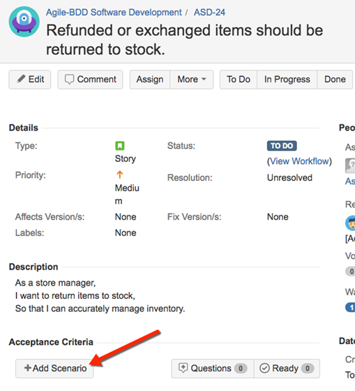

# Using Behave Pro

This section contains articles that describe how to use Behave Pro features within JIRA. Use the menu at the left, or click one of the links below.

## Add a Scenario to a JIRA Issue

In JIRA, developers will use an issue to manage a user story or software requirement. Consider an example requirement for inventory management, in which a store manager wants any item that arrives as a result of a refund or an exchange to be put back into stock.


"Refunded or exchanged items should be returned to stock."


At right, we show the JIRA issue that represents this requirement.A scenario is an example that clearly elucidates the requirements. The Behave Pro plugin adds features to JIRA so that team members can associate one or more scenarios with a JIRA issue.



Often, it's best to have two or more examples.Here is are the steps for one scenario that complements the JIRA issue above:
 
```gherkin
Given a customer previously bought a black sweater
And I currently have three black sweaters left in stock
When the customer returns the sweater for a refund
Then I should have four black sweaters in stock
```
 
Below the **Description**, in the **Acceptance Criteria** of the JIRA Issue page, you'll find the **+ Add Scenarios** button. Click that button to add a **scenario**, then enter the **Feature** name, **Scenario** title and the **Steps**. When the scenario is complete, click the **Create Scenario** button. See the figure to the right.
 
For illustration, here is another scenario that you could add to this issue:

```gherkin
Given that a customer buys a blue garment
And I have two blue garments in stock
And I have three black garments in stock
When he returns the garment for a replacement in black
Then I should have three blue garments in stock
And two black garments in stock
```

## Link a Scenario to a JIRA Issue

You can link an existing scenario to an issue, so that any modifications to that scenario will generate an email notification explaining the content of the change and the user who made the change.
To link a scenario to an issue, follow the steps below.

1\. Navigate to the **Specification** page an, on the left, choose a scenario that you want to link to a specific issue.

2\. Click the small JIRA icon adjacent to the **Scenario** heading.


3\. A pop-up window will appear, similar to the figure below. Click the **Link existing issue** button.


4\. In the text box, begin typing to search your issue list. When the issue is found click the **Link** button to establish the link.

## Status Mapping

### Mapping custom statuses from JIRA to Behave Pro

You can map custom JIRA statuses to the Behave Pro statuses by dragging unmapped statuses to a one of 3 columns, "Open", "Work in Progress" and "Closed".

* **OPEN** for scenarios attached to issues that have not been started yet
* **WIP** for scenarios attached to issues that are in progress, useful for selecting the current working set of scenarios
* **COMPLETED** for scenarios attached to resolved issues, useful for regression testing existing functionality

These statuses will be applied as tags on the exported scenarios, allowing you to filter them in the BDD tool of your choice. For example, in Cucumber-JVM, you would run WIP scenarios as follows:

> $ cucumber --tags @WIP

To map your statuses to Behave Pro, go to the project administration page and click on the Behave Pro mapping sidebar item.


Any statuses that you have added to JIRA should show up in in the unmapped column, drag them to the appropriate column and it will autosave. That's it! Simple!

# Test Automation

Once you have written your Scenarios inside JIRA, you can pull them to your development environment using one of our clients. We currently have clients for Maven and Gradle with Java, the .NET platform, Python and Ruby.

## Java with Maven

The first step is to add the Hindsight Software Maven repository to your projects Maven pom file.

```xml
<pluginRepositories>
    <pluginRepository>
        <snapshots>
            <enabled>false</enabled>
        </snapshots>
        <id>hindsighttesting.release</id>
        <name>Hindsight Software Release Repository</name>
        <url>http://repo.hindsightsoftware.com/public-maven</url>
    </pluginRepository>
</pluginRepositories>
```

Next, the plugin declaration can be added to the pom file. The plugin has 4 required parameters: "server" which is the url to your JIRA Server instance and "projectKey" which is the key of the ID of the project you want to generate acceptance tests for, "username" the User ID for accessing Behave Pro and "password" the API Key for authenticating the User ID and Project ID's.

```xml
<plugin>
    <groupId>com.hindsighttesting.behave</groupId>
    <artifactId>behave-maven-plugin</artifactId>
    <version>1.0.4</version>
    <configuration>
        <server>https://behave.pro</server>
        <projectKey>10100</projectKey>
        <username>REPLACE WITH YOUR JIRA USERNAME</username>
        <password>REPLACE WITH YOUR JIRA PASSWORD</password>
    </configuration>
    <executions>
        <execution>
            <goals>
                <goal>features</goal>
            </goals>
        </execution>
    </executions>
</plugin>
```

<aside class="notice">
You must replace <code>username</code> and <code>password</code> with your personal JIRA credentials.
</aside>

### Configuring Cucumber

The first step is to add the cucumber dependencies to the maven project. We will be using Cucumber's JUnit runner to run our tests so JUnit will also be a dependency.

```xml
<dependencies>
    ...
    <dependency>
        <groupId>info.cukes</groupId>
        <artifactId>cucumber-picocontainer</artifactId>
        <version>1.0.10</version>
        <scope>test</scope>
    </dependency>
    <dependency>
        <groupId>org.picocontainer</groupId>
        <artifactId>picocontainer</artifactId>
        <version>2.14.1</version>
    </dependency>
    <dependency>
        <groupId>info.cukes</groupId>
        <artifactId>cucumber-junit</artifactId>
        <version>1.0.10</version>
        <scope>test</scope>
    </dependency>
    <dependency>
        <groupId>junit</groupId>
        <artifactId>junit</artifactId>
        <version>4.10</version>
        <scope>test</scope>
    </dependency>
    ...
</dependencies>
```

Create a java class called "CucumberIT" in the "src/test/java" folder of your maven project. Annotate this class with the following annotations.

```java
import org.junit.runner.RunWith;
import cucumber.junit.Cucumber;

@RunWith(Cucumber.class)
@Cucumber.Options(format = { "json", "json:target/cucumber.json" }, features = { "target/generated-test-sources/" }, strict = true)
public class CucumberIT {

}
```

These annotations turn a standard JUnit test into a cucumber test which loads and executes the scenarios from JIRA (The behave-maven-plugin generates these). To run this JUnit/Cucumber test during the Maven integration-test phase you need to add the maven failsafe plugin.

```xml
<plugin>
    <groupId>org.apache.maven.plugins</groupId>
    <artifactId>maven-failsafe-plugin</artifactId>
    <version>2.12</version>
    <executions>
        <execution>
            <id>integration-test</id>
            <goals>
                <goal>integration-test</goal>
                <goal>verify</goal>
            </goals>
        </execution>
    </executions>
</plugin>
```

When you put this all together and run it using "mvn verify" the acceptance tests are extracted from JIRA and run by cucumber. From the output of Maven you can see the tests failed. They failed because Cucumber is trying to match each step in your Scenario with a method in Java and could find any matches. If it finds a matching method it will execute it or it fails the scenario (Test) and skip over the remaining steps in the scenario. All that is left to do is implement the cucumber step definitions.
When Cucumber can't find a matching method to a step it will generate a code snippet for you to copy into your code and implement. In the console before the test results you will see code snippets for all the steps. All that is left to do is implement the cucumber step definitions by creating a new Java class in our project and copy 'n' paste the snippets

## Java with Gradle

The Gradle task can be installed automatically by configuring your Gradle scripts to fetch the task and its dependencies using standard Maven resolution.

```groovy
buildscript {
    repositories {
        maven { url 'http://repo.hindsightsoftware.com/public-maven' }
        mavenCentral()
    }
    dependencies {
        classpath group: 'com.hindsighttesting.behave', name: 'behave-gradle-task', version: '1.0.0-1'
    }
}
```

The above script will automatically download the task from the Hindsight Maven repository, and make it available to the buildScript of your projects.

### Configuration

#### Adding a task to download Acceptance Tests from Behave

To download the Acceptance Tests (Feature files) you need to create a task implementing "com.hindsighttesting.behave.gradle.FeaturesTask". This type has been added by the automatic installation described above.

```groovy
task behavefeatures(type: com.hindsighttesting.behave.gradle.FeaturesTask) {
    projectKey = '10100'
    server = 'https://behave.pro'
    username = 'REPLACE WITH YOUR JIRA USERNAME'
    password = 'REPLACE WITH YOUR JIRA PASSWORD'
    destinationDir = 'build/generated-test-sources/cucumber'
}
```

<aside class="notice">
You must replace <code>username</code> and <code>password</code> with your personal JIRA credentials.
</aside>

#### Configuring Cucumber

Don't forget to execute the Behave Download Task before executing Cucumber, or you won't have any tests to execute. This can be simply done by adding a dependency from your Cucumber task to the Behave Task.

> dependsOn assemble, behavefeatures

Also you will need to tell Cucumber where to find the Acceptance Tests (Feature files) you have downloaded (The "destinationDir" property in the Behave Task)

```groovy
args = ['-f', 'pretty', '--glue', 'build/classes/test', 'build/generated-test-sources/cucumber']
```

## Ruby

You have two options for working Behave, Cucumber and Ruby:
1. The command line client
2. Rake build scripts
Both require the Behave gem to be installed

### Installing the Behave gem

The gem is hosted on RubyGems at https://rubygems.org/gems/behave and is available direct from the website or using RubyGems. Assuming you have Ruby and RubyGems installed on your system, run

> $ gem install behave

and you will have installed the behave ruby client and its dependencies. Depending on your system, you may have to prefix the command with "sudo"

### Using the command line

Installing the gem will have placed a binary on your path named "behave". The output of "behave --help" is as follows:

```bash
Usage: behave [options]

Specific options:
    -h, --host HOST                  Host URI for JIRA installation - This should be https://behave.pro
    -u, --user USER                  JIRA username
    -p, --pass PASS                  JIRA Password
    -k, --key KEY                    Project ID from the JIRA Project Admin Page
    -d, --directory [DIR]            Specify output directory (default 'features')
    -m, --manual                     Include manual tagged scenarios in download
        --proxy PROXY_URL            Pass requests through a PROXY_URL
        --bypass-ssl                 Bypass SSL certificate checking
        --help                       Show this message
        --version                    Show version
```

> An example call could look like this:

```bash
$ behave --host https://behave.pro \
  --user "REPLACE WITH YOUR JIRA USERNAME" \
  --pass "REPLACE WITH YOUR JIRA PASSWORD" \
  --key 10100 \
  --directory features \
  --manual
```

<aside class="notice">
You must replace <code>username</code> and <code>password</code> with your personal JIRA credentials.
</aside>

This would download all .feature files from the PROJ project to the features directory (relative to the directory behave was run from), including all scenarios tagged as manual. Host and Key are the only required arguments, which defaults to an anonymous login downloading all features to the directory the command is run from.

### Rake

You are more than likely to be using Rake in your Ruby project for scripting your builds. Cucumber comes with its own Rake task ready for you to use and looks like this

```ruby
require 'cucumber/rake/task'

Cucumber::Rake::Task.new(:features) do |t|
  t.cucumber_opts = "--format pretty"
end
```

This cucumber task can be executed using the following command

> $ rake features

As our Features and Scenarios are stored within JIRA we will need to download them. To do this we will add a new Rake task that will download them using the "Behave" Ruby gem.

```ruby
require 'behave'

desc "Download features"
task :download do
  Behave::FeatureDownloader.new({
    'host'   => 'https://behave.pro',
    'user'   => 'REPLACE WITH YOUR JIRA USERNAME',
    'pass'   => 'REPLACE WITH YOUR JIRA PASSWORD',
    'key'    => 10100,
    'dir'    => 'features',
    'manual' => true
  })
end
```

<aside class="notice">
You must replace <code>username</code> and <code>password</code> with your personal JIRA credentials.
</aside>

This task can be executed using the following command

> $ rake download

We can now download our Features and Scenarios from JIRA but we will always have to remember to run "rake download" before "rake features". To avoid this we can configure the Cucumber "features" task to depend on the Behave "download" task and execute it before running Cucumber. This just requires one additional line in your rake file.

```ruby
task :features => :download
```

> The full Rakefile can be found in the example project on [Bitbucket](https://bitbucket.org/hindsightsoftwareltd/behave-ruby-example/src)

### Proxy
If you need to specify a proxy to pass requests through, use the --proxy flag from the command line or pass 'proxy' => 'MY_PROXY' argument into FeatureDownloader i.e.

```bash
$ behave --host https://behave.pro \
  --proxy https://some.proxy.url
```

> or

```ruby
task :download do
  Behave::FeatureDownloader.new({
    ...
    'proxy' => 'http://some.proxy.url'
    ...
  })
end
```

### Bypassing SSL

If you experience problems with your SSL certificate, you can bypass SSL checking in behave by using the --bypass-ssl command line flag, or the 'bypass_ssl' => true FeatureDownloader argument.

## .NET

The Gherkin-compatible BDD tool that is generally used with .NET is [SpecFlow](http://http//www.specflow.org/).
We host our .NET client on the [NuGet gallery](http://www.nuget.org/packages/Hindsight.Behave), and it is available through the NuGet Packet Manager Shell:

> PM> Install-Package Hindsight.Behave

Alternatively, you can use the built in NuGet Gallery interface from inside Visual Studio 2010/12

### Using within a script

You can use the JIRA Connector within your own scripts to download features from Behave:

```c#
Using Hindsight.Behave;

public class Demo
{
    public void Download()
    {
        JiraConnector jc = new JiraConnector("https://behave.pro");
        jc.Fetch(
            // The project id of the target project
            project: "10100",
            // The API Key username
            username: "REPLACE WITH YOUR JIRA USERNAME",
            // The API Key value
            password: "REPLACE WITH YOUR JIRA PASSWORD",
            // Directory to extract features to (relative to script)
            directory: "features",
            // Boolean whether to include manual tests
            manual: true,
            // Boolean whether to verify the SSH certificate
            verify: true,
            // Boolean whether to return feature files that
            // are compatible with NUnit.
            isNUnit: true
        )
    }
}
```

<aside class="notice">
You must replace <code>username</code> and <code>password</code> with your personal JIRA credentials.
</aside>

This will download all features from project ID 10100 into the features director, including manual tagged scenarios.

### Using with MSBuild

You can use the Behave assembly as an MSBuild task as part of your build process. You can modify the build process for a project by "unloading" it in Visual Studio (right click the project in the solution explorer and click "Unload Project") and then right clicking and clicking "Edit {PROJECT}.csproj", or editing the .csproj file directly in the directory for the project.
Create a new reference to the Behave.dll assembly, which will be in your project after using NuGet to install it:

```xml
<UsingTask
    TaskName="Behave"
    AssemblyFile="path\to\the\Behave.dll" />
```

You can then use the Behave task to fetch features, either in one of the existing BeforeBuild or AfterBuild target blocks, or by defining your own as we have below:

```xml
<Target Name="Test">
    <Behave
        host="https://behave.pro"
        project="10900"
        username="REPLACE WITH YOUR JIRA USERNAME"
        password="REPLACE WITH YOUR JIRA PASSWORD"
        directory="Features\"
        manual="true" />
</Target>
```

<aside class="notice">
You must replace <code>username</code> and <code>password</code> with your personal JIRA credentials.
</aside>

<aside class="notice">
Add nunit="true" to the task options if you need to use the NUnit runner. This strips characters from tags (traits) that NUnit doesn't work with.
</aside>

### Step by Step with Visual Studio 2013

This guide will take you from a new solution through to integrating Behave Pro with SpecFlow, and running the feature files.

### Visual Studio setup

Install **SpecFlow for Visual Studio 2013** from the Extensions and Updates dialog in the Tools menu, and restart Visual Studio when prompted.


### Project setup

Create a new solution, containing a project for the Application and a project for the Specs (download the prepared solution file [here](http://docs.behave.pro/assets/BehaveProExample.zip)).


Install the **Hindsight.Behave**, **SpecFlow**, **SpecFlow.NUnit**, **NUnit**, **NUnit.Runners** and **NUnitTestAdapter** into your solution, using the NuGet Package Manager from the Tools menu.


### Configuring MSBuild task

Unload the Specs project, in order to edit the .csproj file (which is the MSBuild configuration used to build that particular project)


In the .csproj file, uncomment the last section of the root Project element which defines Targets, and add the below code:

```xml
...
<UsingTask
    TaskName="Behave"
    AssemblyFile="..\packages\Hindsight.Behave.0.1.8\lib\Behave.dll" />
<Target Name="BeforeBuild">
    <Behave
        host="https://behave.pro"
        project="10900"
        username="REPLACE WITH YOUR JIRA USERNAME"
        password="REPLACE WITH YOUR JIRA PASSWORD"
        directory="Features\"
        manual="true" 
        nunit="true />
</Target>
```

<aside class="notice">
You must replace <code>username</code> and <code>password</code> with your personal JIRA credentials.
</aside>

In the UsingTask block, the AssemblyFile path can be found further up the .csproj file:


Then, reload the project from the Project Explorer.

### Fetching and including Feature files from Behave Pro

By building the Specs project, the Feature files will be fetched from Behave Pro. They will not initially be visible in the project explorer, so if you click "Show All Files" you can include the Features directory into the project.


### Generating step definitions

Follow the [SpecFlow Getting Started guide](http://www.specflow.org/getting-started/) to generate Step definitions for all the .feature files that were fetched.

### Filtering which scenarios to run

The build tool will download all the features for the project to your local machine. In order to only run certain tests (e.g. by tag, by assignee, by issue), switch the Test Explorer view to Traits.


## Python

We host our Python client [PyPi](http://pypi.python.org/pypi/hindsight), and it is available through pip or by direct download. Assuming you have Python and pip installed on your system, run:

> $ pip install hindsight

You will have installed the behave python client and all its dependencies. Depending on your system, you may have to prefix the command with "sudo"

### Using from the command line

Installing the package will have placed a binary on your path named "behave-cli". The output of "behave-cli --help" is as follows:

> $ behave-cli HOST KEY [-u USERNAME] [-p PASSWORD] [-d DIR] [-m]

An example usage would be:

```shell
$ behave-cli https://behave.pro 10100 \
  -u "REPLACE WITH YOUR JIRA USERNAME" \
  -p "REPLACE WITH YOUR JIRA PASSWORD" \
  -d features \
  -m
```

<aside class="notice">
You must replace <code>username</code> and <code>password</code> with your personal JIRA credentials.
</aside>

which uses your API key user name and value to download features from project ID 10100 into the features directory, including all manual scenarios.

### Using from within a script

You can use the JIRA connector within your own scripts to download features from Behave

```python
#!/usr/bin/env python

from hindsight.behave import JiraConnector

jc = JiraConnector()
jc.fetch(
  host='https://behave.pro',
  username='REPLACE WITH YOUR JIRA USERNAME',
  password='REPLACE WITH YOUR JIRA PASSWORD',
  key='10100',
  dir='features',
  manual=True
)
```

<aside class="notice">
You must replace <code>username</code> and <code>password</code> with your personal JIRA credentials.
</aside>

This will download all features from project ID 10100 into the features director, including manual tagged scenarios.

## NodeJS

The Behave Pro Node client is available from [NPM](https://www.npmjs.com/package/behavepro), and can be installed using the following:

> $ npm install behavepro -g

NodeJS and NPM are both required to be installed.

### Using from the command line

Parameters can either be passed from the command line:

> $ behavepro [--id PROJECT ID] [--userId USER] [--apiKey KEY]

Available parameters:

* **[--host HOST]** Behave Pro host (JIRA instance url)
* **[--id PROJECT ID]** JIRA project id
* **[--userId USER]** JIRA username
* **[--apiKey KEY]** JIRA password
* **[--output DIRECTORY]** Output directory - default: 'features'
* **[--manual]** Include scenarios marked as manual
* **[--config CONFIG]** JSON config file - relative to current directory

<aside class="notice">
You must replace <code>username</code> and <code>password</code> with your personal JIRA credentials.
</aside>

If the three required parameters are missing, they will be attempted to be read from a json config file in the current directory:

> $ behavepro

`config.json` example

```json
[{
    "id": 10000,
    "userId": "REPLACE WITH YOUR JIRA USERNAME",
    "apiKey": "REPLACE WITH YOUR JIRA PASSWORD"
}, {
    "id": 10100,
    "userId": "REPLACE WITH YOUR JIRA USERNAME",
    "apiKey": "REPLACE WITH YOUR JIRA PASSWORD"
}]
```

### Using from within a script

You can use the client in your own scripts to download features from Behave Pro.

> $ npm install behavepro --save

```javascript
var BehavePro = require('behavepro');

BehavePro({
  "id": 10000,
  "userId": "REPLACE WITH YOUR JIRA USERNAME",
  "apiKey": "REPLACE WITH YOUR JIRA PASSWORD"
}, function() {
  // done
});
```

Available parameters:

* **"host": HOST** - Behave Pro host - default: 'https://behave.pro'
* **"id": ID** - JIRA project id
* **"userId": USERID** - JIRA username
* **"apiKey": APIKEY** - JIRA password
* **"output": DIRECTORY** - Output directory - default: 'features'
* **"manual": true** - Include scenarios marked as manual